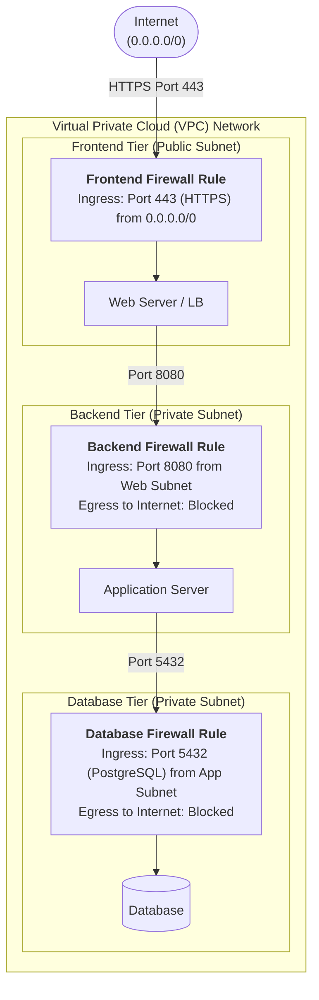
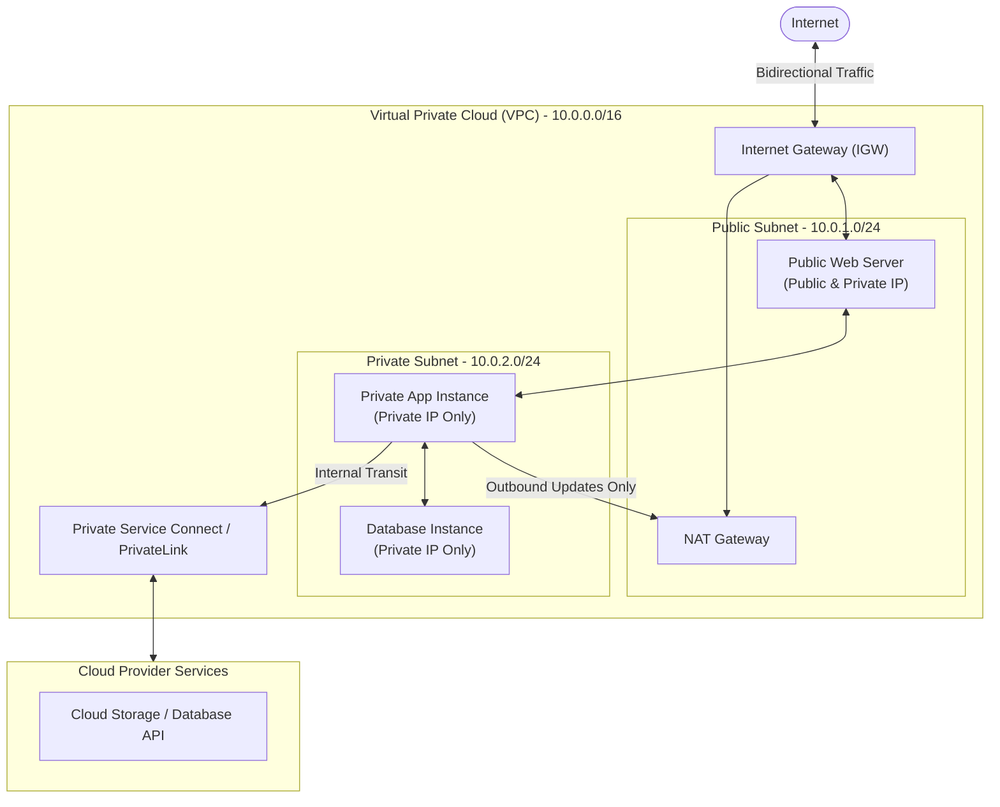

Cloud cybersecurity focuses on protecting data, applications, and infrastructure hosted in cloud environments (like AWS, Google Cloud, or Microsoft Azure). While traditional security relies on a physical perimeter (like a building firewall), cloud security operates around software-defined boundaries, identity verification, and continuous monitoring.

---

### 1. Cloud Network Security & Cloud Firewalls

Cloud networks are entirely virtualized (Software-Defined Networking or SDN). Traditional hardware firewalls are replaced by virtual firewall rules enforced directly at the hypervisor or network layer.

#### Key Cloud Firewall Concepts

* **Micro-segmentation:** Dividing the network into granular isolated zones so that if one virtual machine (VM) is compromised, the attacker cannot easily move laterally to other systems.
* **Stateful Filtering:** Most cloud firewalls track the state of active network connections. If outbound traffic is allowed, the returning response traffic is automatically permitted.
* **Stateless Filtering:** Evaluates incoming and outgoing traffic independently against explicitly defined rules (often used in network access control lists).
* **Example:** A 3-tier web application setup:
  * **Frontend Firewall Rule:** Allows inbound traffic from the internet (`0.0.0.0/0`) on port `443` (HTTPS) to Web Servers only.
  * **Backend Firewall Rule:** Blocks internet access entirely; only allows traffic coming from the Web Server subnet on port `8080` to the Application Servers.
  * **Database Firewall Rule:** Allows connections *only* from Application Servers on port `5432` (PostgreSQL).

---

### 2. Virtual Private Clouds (VPC)

A **Virtual Private Cloud (VPC)** is your own isolated, virtual network inside a public cloud environment. It gives you full control over network topology, IP addressing, and routing.

#### Core VPC Concepts

* **Subnets:** Sub-divisions of a VPC network defined by IP range blocks (CIDR notation, e.g., `10.0.1.0/24`).
  * *Public Subnets:* Connected to the Internet Gateway; instances have public IP addresses.
  * *Private Subnets:* No direct route to the public internet; isolated for backend databases and private internal workloads.

* **Internet Gateway (IGW):** A VPC component that allows communication between resources in your public subnet and the internet.
* **NAT Gateway (Network Address Translation):** Placed in a public subnet to allow instances in private subnets to reach the internet (e.g., for system/software updates) while preventing the outside internet from initiating connections back to them.
* **VPC Peering & Private Endpoints:**
  * *VPC Peering:* Connects two separate VPCs privately using internal IP addresses.
  * *Private Service Connect / PrivateLink:* Allows private access to managed services (like cloud databases or storage APIs) without routing traffic through the public internet.

