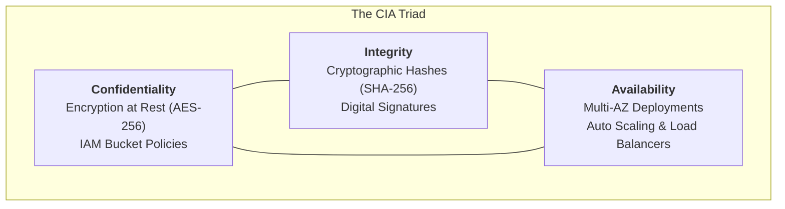
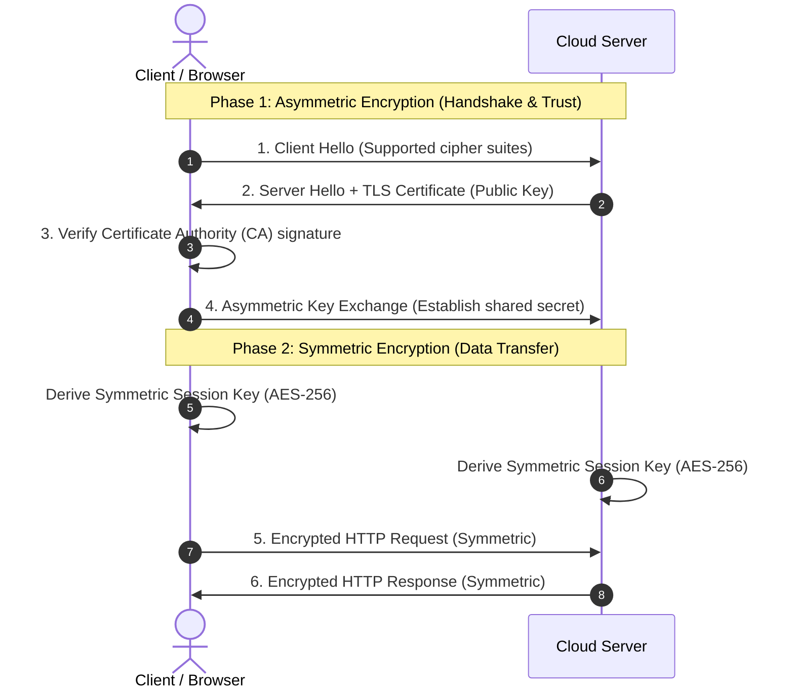
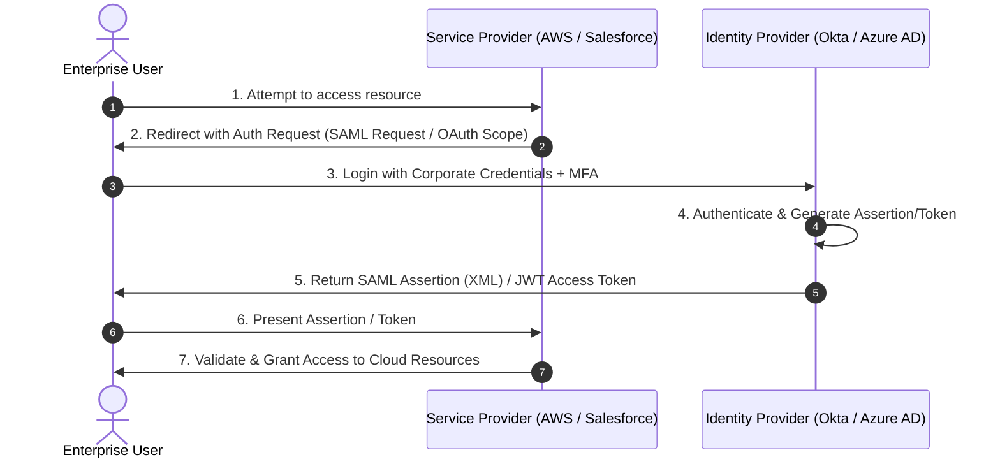
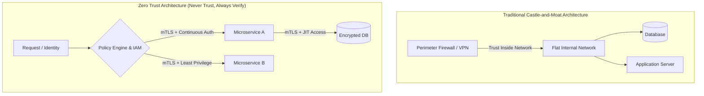

```mermaid
flowchart TD
    User([User / Client]) -->|1. Credentials / MFA| AuthN[Authentication Server]
    AuthN -->|2. Verify Identity| IdentityStore[(Identity Store)]
    IdentityStore -->|3. Identity Verified| AuthN
    AuthN -->|4. Issue Identity / Token| User
    User -->|5. Request Resource + Token| AuthZ[Authorization Engine]
    AuthZ -->|6. Evaluate Policy & Scopes| PolicyEngine{Check IAM / Policy}
    PolicyEngine -->|Allowed| Grant[Grant Access to Resource]
    PolicyEngine -->|Denied| Deny[Deny Request - 403 Forbidden]
```

Cloud security builds directly on core cybersecurity models, adapted for distributed environments. Here is a breakdown of foundational concepts, mechanisms, and real-world implementations.

---

## 1. The CIA Triad

The CIA Triad serves as the foundational model for guiding security policies and architecture.

* **Confidentiality:** Ensures data is accessible only to authorized entities.
  * *Cloud Example:* Encrypting S3 buckets at rest using AES-256 and restricting bucket access via IAM policies.
* **Integrity:** Guarantees that data remains unaltered and trustworthy during storage and transit.
  * *Cloud Example:* Using cryptographic hashes (like SHA-256) or digital signatures to verify that software artifacts or API payloads have not been tampered with.
* **Availability:** Assures systems and data are accessible to users when needed.
  * *Cloud Example:* Deploying applications across multi-Region availability zones behind an Auto Scaling group and Load Balancer to survive hardware failures and DDoS attacks.



---

## 2. Symmetric vs. Asymmetric Encryption

Encryption transforms plain text into unreadable cipher text. The key distinction lies in key management.

| Feature | Symmetric Encryption | Asymmetric Encryption |
| --- | --- | --- |
| **Key Mechanism** | Uses **one single secret key** for both encryption and decryption. | Uses a **key pair**: a **Public Key** (encrypts/verifies) and a **Private Key** (decrypts/signs). |
| **Speed & Performance** | Fast and computationally lightweight. | Slower due to heavy mathematical operations. |
| **Primary Use Cases** | Bulk data encryption (databases, file systems, disk storage). | Key exchange, digital signatures, establishing secure connections. |
| **Common Algorithms** | AES-256, ChaCha20 | RSA, ECC (Elliptic Curve Cryptography) |

---

### Real-World Hybrid Encryption Example: TLS / HTTPS

Modern cloud systems combine both encryption types to balance security and performance (e.g., HTTPS connection):

1. **Handshake (Asymmetric):** The client and cloud server perform an asymmetric key exchange (using RSA/ECC) to authenticate identity and establish trust without sending secrets in cleartext.
2. **Data Transfer (Symmetric):** Once trusted, both sides derive a temporary **session key** (Symmetric AES key) to rapidly encrypt all actual HTTP traffic.



---

## 3. Authentication vs. Authorization

* **Authentication (AuthN):** *Who are you?* The process of verifying an entity's identity (e.g., credentials, MFA tokens, biometrics).
* **Authorization (AuthZ):** *What are you allowed to do?* The process of granting permissions to authenticated entities.

```
+------------------+         Verifies Identity        +------------------+
|  User / Client   | -------------------------------> |  Authentication  |
+------------------+                                  +------------------+
         |                                                     |
         | Presents Token/Identity                             v
         |                                            +------------------+
         +------------------------------------------> |  Authorization   |
                                                      +------------------+
                                                               |
                                                       Grants/Denies Access
```



---

## 4. Federated Identity Standards: OAuth 2.0 & SAML

Federated identity lets users access multiple cloud resources using a single set of credentials (SSO).

### OAuth 2.0 (Authorization Framework)

OAuth 2.0 delegates access rights. Instead of sharing password credentials, an app receives an **Access Token** (often a JWT) with specific scopes. *(Note: OpenID Connect / OIDC sits on top of OAuth 2.0 to add authentication capabilities).*

* **Use Case:** Allowing a third-party CI/CD pipeline access to deploy containers into your AWS/GCP infrastructure without embedding static root keys.
* **Format:** JSON Web Tokens (JWT).

### SAML 2.0 (Security Assertion Markup Language)

SAML is an XML-based open standard for exchanging authentication and authorization data between an Identity Provider (IdP, like Okta or Azure AD) and a Service Provider (SP, like Salesforce or AWS IAM Identity Center).

* **Use Case:** Enterprise Single Sign-On (SSO) for corporate employees logging into cloud dashboards via corporate credentials.
* **Format:** XML assertions.



---

## 5. Cloud IAM Policy Structures & Zero Trust Architecture

Identity and Access Management (IAM) policies act as the security boundary in cloud infrastructure, while Zero Trust forms the overarching operational mindset. Here is a breakdown of how both function together.

---

### Cloud IAM Policy Structures

An IAM policy is a JSON document that defines who can perform what actions on which cloud resources under specified conditions.

#### Core Anatomy of a Cloud Policy

Most major cloud platforms (AWS, GCP, Azure) share a similar structural blueprint for policy statements:

* **Effect:** Dictates whether the policy allows or explicitly denies the request (`Allow` vs `Deny`). *Explicit denies always override allows.*
* **Principal:** Specifies **who** the policy applies to (e.g., a specific user, service role, or group).
* **Action:** Defines **what API calls** are allowed or blocked (e.g., `s3:GetObject`, `ec2:RunInstances`).
* **Resource:** Identifies **which assets** are affected, using unique identifiers like Amazon Resource Names (ARNs).
* **Condition:** Sets extra guardrails required for execution (e.g., enforcing MFA, limiting access to a specific IP range, or restricting time windows).

#### Practical Example: Least-Privilege S3 Access

This AWS IAM policy grants read-only access to a specific production bucket—strictly enforcing TLS encryption and corporate IP origin:

```json
{
  "Version": "2012-10-17",
  "Statement": [
    {
      "Sid": "AllowReadOnlyAccessToProdData",
      "Effect": "Allow",
      "Action": [
        "s3:GetObject",
        "s3:ListBucket"
      ],
      "Resource": [
        "arn:aws:s3:::company-prod-data",
        "arn:aws:s3:::company-prod-data/*"
      ],
      "Condition": {
        "Bool": {
          "aws:SecureTransport": "true"
        },
        "IpAddress": {
          "aws:SourceIp": "198.51.100.0/24"
        }
      }
    }
  ]
}
```

---

### Zero Trust Architecture (ZTA)

Traditional security relied on perimeter defenses ("castle-and-moat"), assuming everything inside the internal network was safe. **Zero Trust operates on a simple rule: "Never trust, always verify."** Every request—whether originating outside or inside the cloud network—must be authenticated, authorized, and encrypted before access is granted.

---

#### Key Pillars of Zero Trust in the Cloud

* **Explicit Verification:** Always authenticate and authorize based on all available data points—including user identity, device health, location, and workload attributes.
* **Least Privilege Access:** Limit user and machine access with Just-In-Time (JIT) and Just-Enough-Access (JEA) risk policies.
* **Assume Breach:** Design networks assuming attackers are already inside. Minimize blast radius by segmenting access, encrypting all communication end-to-end, and continuously analyzing analytics to gain visibility.

---

#### Traditional vs. Zero Trust Architectural Comparison

| Security Domain | Traditional Cloud Setup | Zero Trust Architecture |
| --- | --- | --- |
| **Network Perimeter** | Flat internal VPC network behind a Bastion host or VPN. | Micro-segmented workloads with strict Security Groups and service meshes. |
| **Identity Verification** | Authenticate once at network entry (e.g., corporate VPN). | Continuous re-evaluation of session context, device health, and MFA tokens. |
| **Inter-Service Communication** | Unencrypted, implicitly trusted east-west traffic between microservices. | Mutual TLS (mTLS) with short-lived service identities for every API call. |



---

## 6. Hands-On IAM Troubleshooting Scenarios

Hands-on troubleshooting is one of the fastest ways to master Cloud IAM. In cloud policy engine logic, two rules govern evaluation:

1. **Explicit Deny Always Wins:** If any policy statement explicitly denies an action, it overrides all `Allow` permissions.
2. **Implicit Deny by Default:** If no statement explicitly permits an action, the request is denied.

Here are three real-world interactive scenarios—spanning broken access, privilege escalation, and unintended cross-account exposure.

---

### Scenario 1: The Broken CI/CD Pipeline (Broken Policy)

#### Context

A developer configured a GitHub Actions pipeline to deploy static assets to an S3 bucket (`arn:aws:s3:::app-static-assets`). The pipeline uses an IAM Role, but deployments fail with an `AccessDenied` error when attempting to list and upload files.

#### The Broken Policy

```json
{
  "Version": "2012-10-17",
  "Statement": [
    {
      "Sid": "AllowS3Uploads",
      "Effect": "Allow",
      "Action": [
        "s3:PutObject",
        "s3:ListBucket"
      ],
      "Resource": "arn:aws:s3:::app-static-assets/*"
    }
  ]
}
```

#### The Challenge

Why is the deployment failing, and how do you fix it?

* **Root Cause:** IAM distinguishes between **bucket-level** operations and **object-level** operations.
  * `s3:ListBucket` works on the bucket itself (`arn:aws:s3:::app-static-assets`).
  * `s3:PutObject` works on objects *inside* the bucket (`arn:aws:s3:::app-static-assets/*`).
  Because the policy attached `s3:ListBucket` strictly to the wildcard ARN `.../*`, the API call to list the bucket fails.

* **The Fix:** Split the permissions by resource target:

```json
{
  "Version": "2012-10-17",
  "Statement": [
    {
      "Sid": "BucketLevelAccess",
      "Effect": "Allow",
      "Action": ["s3:ListBucket"],
      "Resource": "arn:aws:s3:::app-static-assets"
    },
    {
      "Sid": "ObjectLevelAccess",
      "Effect": "Allow",
      "Action": ["s3:PutObject"],
      "Resource": "arn:aws:s3:::app-static-assets/*"
    }
  ]
}
```

---

### Scenario 2: The Rogue Developer Role (Overly Permissive)

#### Context

A junior developer was tasked with granting an application server permission to view user profiles stored in a DynamoDB table (`UserProfileTable`). To save time, they committed this policy to production.

#### The Dangerous Policy

```json
{
  "Version": "2012-10-17",
  "Statement": [
    {
      "Sid": "ReadUserData",
      "Effect": "Allow",
      "Action": [
        "dynamodb:GetItem",
        "dynamodb:Scan",
        "iam:*"
      ],
      "Resource": "*"
    }
  ]
}
```

#### The Challenge

Identify the **two high-risk vulnerabilities** in this policy and rewrite it according to the Principle of Least Privilege.

* **Vulnerabilities:**
  1. **Privilege Escalation (`iam:*` on `*`):** Granting full IAM permissions allows the compute instance to create new admin users, attach managed policies to itself, or delete security guardrails.
  2. **Unbounded Data Access (`Resource: "*"` + `dynamodb:Scan`):** The policy allows scanning *every* DynamoDB table in the AWS account, risking mass data exfiltration and high billing charges.

* **The Fix:** Remove IAM privileges and constrain the DynamoDB scope to the exact target table:

```json
{
  "Version": "2012-10-17",
  "Statement": [
    {
      "Sid": "ReadSpecificTableOnly",
      "Effect": "Allow",
      "Action": [
        "dynamodb:GetItem",
        "dynamodb:Query"
      ],
      "Resource": "arn:aws:dynamodb:us-east-1:123456789012:table/UserProfileTable"
    }
  ]
}
```

*(Note: Replacing `Scan` with `Query` prevents full table sweeps during standard lookups).*

---

### Scenario 3: The Confused Deputy & Cross-Account Exposure

#### Context

Your company operates Account A (`111111111111`). You integrated a third-party SaaS monitoring tool (Account B: `999999999999`) by creating a cross-account IAM Role that the vendor assumes to pull metrics.

#### The Misconfigured Trust Policy

```json
{
  "Version": "2012-10-17",
  "Statement": [
    {
      "Effect": "Allow",
      "Principal": {
        "AWS": "arn:aws:iam::999999999999:root"
      },
      "Action": "sts:AssumeRole"
    }
  ]
}
```

#### The Challenge

What vector does this policy expose your cloud environment to, and how do you remediate it?

* **Vulnerability (The Confused Deputy Problem):** This trust policy allows **any customer** using Vendor B's platform to trick Vendor B into assuming your role and accessing your Account A data.
* **The Fix:** Enforce a unique secret identifier using an `sts:ExternalId` condition statement, alongside limiting access to the vendor's explicit role:

```json
{
  "Version": "2012-10-17",
  "Statement": [
    {
      "Effect": "Allow",
      "Principal": {
        "AWS": "arn:aws:iam::999999999999:role/VendorMonitoringRole"
      },
      "Action": "sts:AssumeRole",
      "Condition": {
        "StringEquals": {
          "sts:ExternalId": "UniqueCompanySecretId_98765"
        }
      }
    }
  ]
}
```
