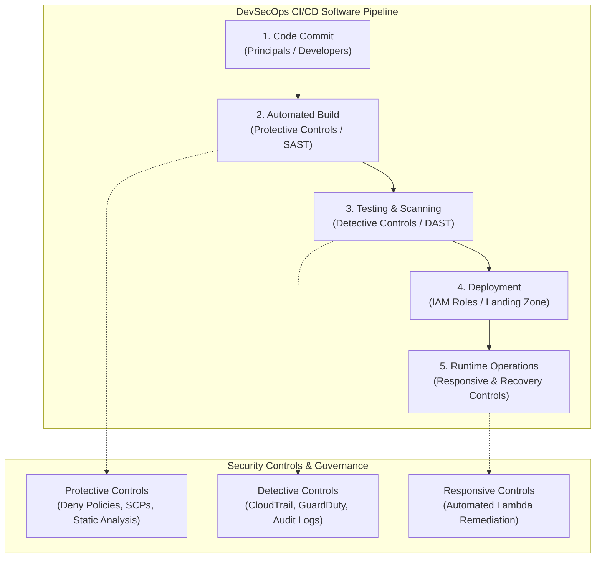
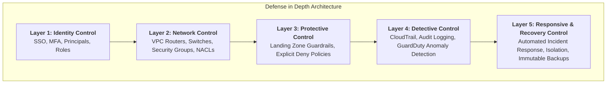
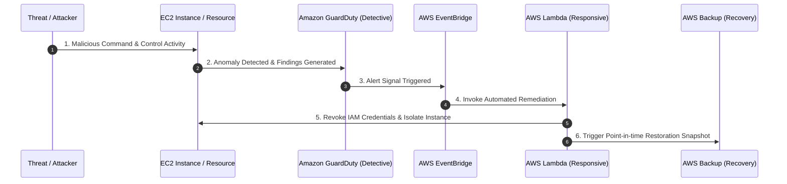

Welcome to Cloud Cybersecurity. Protecting resources in the cloud requires shifting from traditional perimeter security to identity-driven, layered defense models.

Below is an alphabetical guide to each concept, covering what it means, why it matters in cloud environments, and a concrete real-world example for each.

---

## DevSecOps and CI/CD Security Architecture

In modern software engineering, DevSecOps integrates security practices directly into software pipelines and CI/CD (Continuous Integration / Continuous Delivery) workflows. Security controls are embedded across every stage of the lifecycle—from initial code commit through automated deployment and continuous runtime monitoring.

---

## Defense in Depth Layered Security Model

Defense in depth structures multiple security controls so that if any individual defensive layer is compromised, underlying layers continue to protect critical assets.

---

## Core Security Concepts Guide

### **Defense in Depth**

* **Concept:** A multi-layered security strategy that places redundant defensive measures throughout an IT system. If one layer fails (e.g., a firewall is bypassed), subsequent layers (e.g., identity checks, encryption, host intrusion detection) continue to protect the asset.
* **Cloud Security Relevance:** Cloud environments cannot rely on a single security boundary. Defense in depth combines IAM policies, network security groups, endpoint protection, and data encryption.
* **Example:** Storing sensitive customer data in an Amazon S3 bucket protected by MFA-required IAM policies, encrypted with AWS KMS keys, restricted to specific IP ranges via a Bucket Policy, and monitored by AWS GuardDuty.

---

### **Deny Policy**

* **Concept:** An explicit rule within an Authorization policy that forbids specific actions or access to resources, overriding any granted permissions ("Allow" policies).
* **Cloud Security Relevance:** Cloud access models default to *Implicit Deny*. However, an *Explicit Deny* ensures critical safeguards (like preventing root account usage or blocking public data access) cannot be accidentally overridden by broad permissive rules.
* **Example:** An AWS IAM policy with an explicit `"Effect": "Deny"` on `s3:DeleteBucket` for all developers, ensuring no one can accidentally delete production databases even if they hold broad admin permissions.

---

### **Detective Control**

* **Concept:** Security controls designed to discover, identify, and log unauthorized events, misconfigurations, or potential threats after or while they occur.
* **Cloud Security Relevance:** Provides visibility into your cloud estate, enabling security teams to audit activity, detect zero-day anomalies, and comply with regulatory requirements.
* **Example:** Enabling **AWS CloudTrail** or **Google Cloud Audit Logs** to track every API request made across your cloud environment, paired with **Amazon GuardDuty** or **Azure Sentinel** to flag suspicious login attempts from unrecognized IP addresses.

---

### **Identity Control**

* **Concept:** Mechanisms that verify who or what is accessing a system (**Authentication**) and dictate what actions they are permitted to perform (**Authorization**).
* **Cloud Security Relevance:** Identity is the new perimeter in cloud security. Because cloud infrastructure is accessible over the internet, strong identity controls replace physical security fences.
* **Example:** Enforcing Single Sign-On (SSO) with Multi-Factor Authentication (MFA) via Microsoft Entra ID (Azure AD) and granting users access using Role-Based Access Control (RBAC).

---

### **Landing Zone**

* **Concept:** A well-architected, multi-account (or multi-subscription) cloud environment pre-configured with baseline security, networking, identity, and governance rules.
* **Cloud Security Relevance:** Prevents teams from deploying workloads into unstructured, unmonitored cloud environments. It provides a secure baseline from day one.
* **Example:** Using **AWS Control Tower** or **Azure Landing Zones** to automatically provision new accounts configured with centralized logging, guardrails (Service Control Policies), default VPCs, and unified billing.

---

### **Lift and Shift**

* **Concept:** A migration strategy (also known as rehosting) where applications are moved from on-premises servers directly to cloud virtual machines with minimal or no code modifications.
* **Cloud Security Relevance:** While fast, "Lift and Shift" often imports legacy security vulnerabilities and unoptimized architecture into the cloud, missing out on cloud-native security controls like managed services or serverless auto-patching.
* **Example:** Migrating a legacy SQL server running on a physical on-premises machine directly onto an Amazon EC2 or Azure Virtual Machine instance without altering the database configuration or application architecture.

---

### **Network Control**

* **Concept:** Measures that manage, segment, filter, and inspect network traffic passing into, out of, or within an infrastructure.
* **Cloud Security Relevance:** Restricts lateral movement within virtual networks (VPCs/VNets) so that a breach in one web server does not expose internal database systems.
* **Example:** Configuring cloud **Security Groups** and **Network Access Control Lists (NACLs)** to allow inbound HTTP/HTTPS traffic from the public internet to web servers while strictly blocking public access to internal application and database subnets.

---

### **Principals**

* **Concept:** Any entity (a human user, a service, an automated process, or an external system) that can request an action on a cloud resource and be authenticated/authorized.
* **Cloud Security Relevance:** Defining principals allows security teams to assign granular permissions to non-human workloads (applications, pipelines) alongside human users.
* **Example:** An IAM User (`john.doe@company.com`), an IAM Role assumed by a microservice, or a Service Account used by a GitHub Actions CI/CD deployment pipeline.

---

### **Protective Control (Preventive Control)**

* **Concept:** Security mechanisms proactively implemented to block unauthorized access, prevent security incidents, or stop misconfigurations before they take effect.
* **Cloud Security Relevance:** Minimizes the blast radius of human error or automated exploits by stopping violations at the API level before deployment.
* **Example:** Setting up an AWS Service Control Policy (SCP) or Azure Policy that hard-blocks any user from creating publicly accessible S3 buckets or unencrypted storage volumes.

---

### **Recovery Control**

* **Concept:** Controls designed to restore operational capabilities, systems, and data after a security incident, outage, or disaster.
* **Cloud Security Relevance:** Ensures business continuity and resiliency against cyber threats like ransomware or destructive data breaches.
* **Example:** Automating daily, immutable point-in-time database snapshots stored in a separate, isolated cloud account with AWS Backup or Azure Backup for fast restoration.

---

### **Responsive Control (Corrective Control)**

* **Concept:** Automated or manual actions triggered immediately following the detection of an alert or security violation to contain and remediate the incident.
* **Cloud Security Relevance:** Reduces the "dwell time" of attackers by responding to threats at machine speed without waiting for human intervention.
* **Example:** An AWS EventBridge rule automatically invoking an AWS Lambda function to revoke a compromised user’s access keys and isolate an EC2 instance the moment GuardDuty detects malicious command-and-control communication.

---

### **Roles**

* **Concept:** An identity credential with specific permission policies attached, designed to be temporarily assumed by principals (users, applications, or services) rather than permanently assigned.
* **Cloud Security Relevance:** Enforces the Principle of Least Privilege and eliminates the danger of long-term hardcoded credentials or API keys.
* **Example:** Assigning an IAM Role to an EC2 instance that temporarily grants it read-only access to a specific S3 bucket, removing the need to hardcode AWS API keys inside the application source code.

---

### **Router**

* **Concept:** A networking device (or software-defined virtual entity) that forwards data packets between different networks based on routing tables and IP address destinations.
* **Cloud Security Relevance:** Virtual Routers inside Cloud VPCs/VNets control how traffic flows between public subnets, private subnets, transit gateways, on-premises networks, and the internet.
* **Example:** Configuring a **Cloud Route Table** in an AWS VPC directing all outbound traffic from private subnets through a NAT Gateway or Virtual Private Gateway for secure inspection.

---

### **Service Level Agreement (SLA)**

* **Concept:** A formal contract between a cloud service provider (CSP) and a customer defining performance metrics, service availability expectations, uptime guarantees, and remediation credits if targets are missed.
* **Cloud Security Relevance:** Dictates the cloud provider’s shared responsibility commitments regarding infrastructure availability, disaster recovery, and maintenance schedules.
* **Example:** Microsoft guaranteeing a 99.99% uptime SLA for Azure Active Directory (Microsoft Entra ID), detailing financial service credits provided if authentication outages breach that threshold.

---

### **Switch**

* **Concept:** A networking device that operates at the Data Link Layer (Layer 2) to connect devices within the same Local Area Network (LAN) using MAC addresses to forward traffic.
* **Cloud Security Relevance:** In public cloud infrastructure, physical switches are abstractly handled by the cloud provider via software-defined networking (SDN), creating isolated virtual networks where packet sniffing between tenant virtual machines is prevented.
* **Example:** On-premises, managed physical switches rely on VLAN segregation. In AWS/Azure, virtual private cloud (VPC) hypervisors logically isolate network interfaces so virtual machines on the same physical host cannot view each other's network packets.
