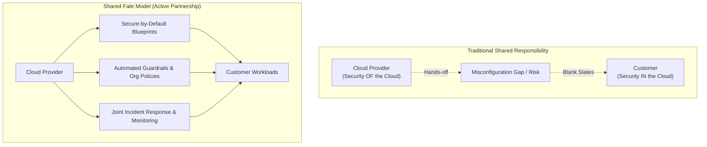

The **Shared Fate Model** is an evolution of the traditional **Shared Responsibility Model**.

Under shared responsibility, the cloud provider secures the infrastructure (*security OF the cloud*), while you secure your data, applications, and configurations (*security IN the cloud*). However, shared responsibility often creates a gap where customers misconfigure tools and experience breaches.

**Shared Fate** bridges this gap. The cloud provider doesn't just hand you tools and walk away; they actively partner with you by offering secure-by-default blueprints, automated guardrails, and joint response capabilities to ensure you succeed in securing your environment.

| Aspect | Shared Responsibility | Shared Fate |
| --- | --- | --- |
| **Approach** | Hands-off partition of tasks. | Active partnership and guided security. |
| **Configuration** | Blank slates; you build from scratch. | Secure-by-default templates and landing zones. |
| **Risk** | Customer bears all configuration risk. | Cloud provider helps actively mitigate misconfiguration. |

* **Example:** In a Shared Fate approach, instead of giving you a blank Google Cloud or AWS account and letting you accidentally leave an S3 bucket public, the provider deploys predefined policy constraints (e.g., *Organization Policy: Enforce public access block*) that prevent public storage buckets from being created in the first place.

