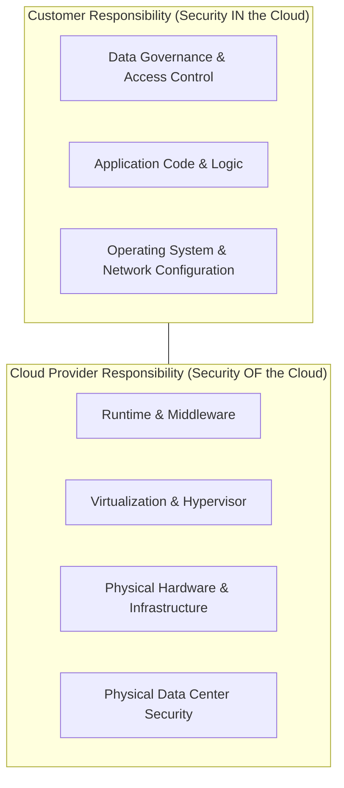

# The Shared Responsibility Model

Shared Responsibility Model is the foundational framework of cloud security. In short, security *in* the cloud is your responsibility, while security *of* the cloud is the cloud provider's (CSP) responsibility.

As you move from Infrastructure as a Service (IaaS) to Platform as a Service (PaaS) and Software as a Service (SaaS), the cloud provider takes on a larger portion of the security operational load, leaving you with less infrastructure to manage.

---

### Core Breakdown by Service Model

* **IaaS (Infrastructure as a Service):** The provider handles the physical facilities, host hardware, and hypervisor virtualization layer. You are responsible for everything from the operating system upward—including OS patching, network configuration (firewalls/subnets), middleware, application logic, and data.
* *Examples:* Amazon EC2, Azure VMs, Google Compute Engine.

* **PaaS (Platform as a Service):** The provider abstracts the hardware, OS, and underlying runtime environment, taking over OS updates and infrastructure patching. You remain responsible for secure code development, application-level configurations, and data management.
* *Examples:* AWS Elastic Beanstalk, Azure App Service, Google App Engine.

* **SaaS (Software as a Service):** The provider manages the complete technology stack—from physical servers to the application user interface and patching. Your primary responsibilities shrink down to access management (who can log in) and data security (what data you put into it).
* *Examples:* Google Workspace, Microsoft 365, Salesforce.

---

### Responsibility Matrix

| Cloud Layer | On-Premises | IaaS | PaaS | SaaS |
| --- | --- | --- | --- | --- |
| **Data & Access Control** | You | You | You | You |
| **Application Code** | You | You | You | Provider |
| **Operating System & Runtime** | You | You | Provider | Provider |
| **Virtualization / Hypervisor** | You | Provider | Provider | Provider |
| **Physical Hardware & Network** | You | Provider | Provider | Provider |
| **Physical Data Center Security** | You | Provider | Provider | Provider |

---

### Real-World Attack Scenarios

* **IaaS Misconfiguration:** An organization provisions an AWS EC2 instance (IaaS) running an unpatched version of Linux. Attackers exploit a known OS vulnerability to compromise the instance and access internal assets. Because the OS layer is customer-managed under IaaS, the customer is fully responsible for failing to apply the patch.
* **PaaS Vulnerability:** A developer deploys a Node.js web application to Azure App Service (PaaS) containing an SQL injection flaw in the user authentication module. Even though Azure maintains the OS and server runtime, the insecure application code remains the developer's responsibility.
* **SaaS Access Compromise:** An employee uses a weak password without Multi-Factor Authentication (MFA) on Google Workspace (SaaS). An attacker uses credential stuffing to log in and steal corporate files. Google maintains application and infrastructure security, but identity and access management remain the customer's responsibility.

---

**Universal Rule:** Regardless of the service model (IaaS, PaaS, or SaaS), **you are always 100% responsible for your data, identity access governance, and endpoint security.**
