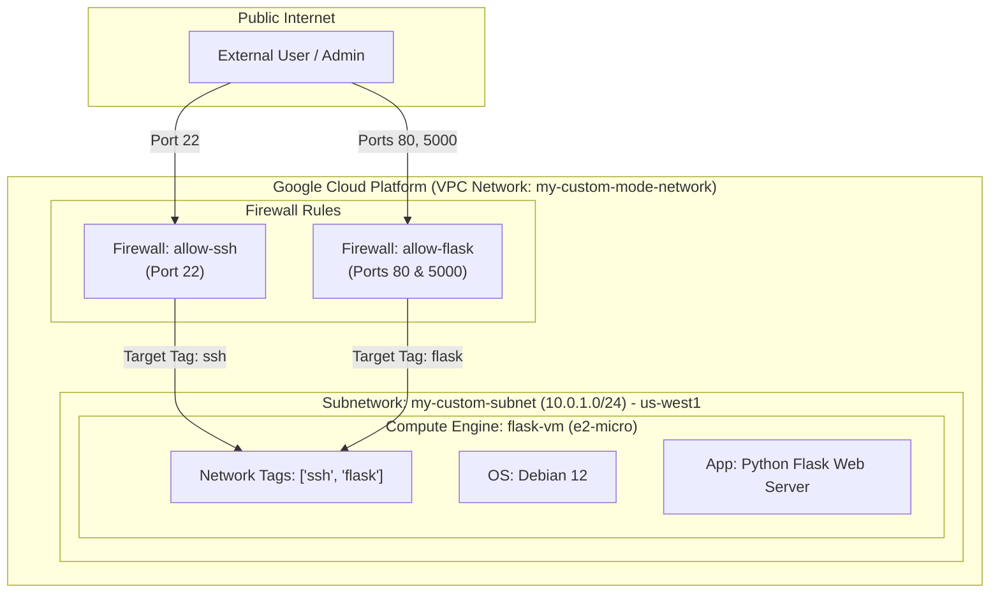

# Terraform Infrastructure Configuration

This document provides a complete guide to provisioning cloud infrastructure on Google Cloud Platform (GCP) using **Terraform (Infrastructure as Code)**. It explains the scenario context, breaks down each configuration block, and compares an unoptimized baseline against a production-ready, hardened configuration.

---

## 1. Scenario & Architectural Context

In modern cloud environments, infrastructure is managed programmatically through **Infrastructure as Code (IaC)** rather than manual console interactions. Terraform uses HashiCorp Configuration Language (HCL) to declaratively state desired cloud resources.

### The Goal
Provision a secure public-facing web server running a **Python Flask application** on Google Cloud Platform. The infrastructure stack consists of:
1. **Custom VPC Network:** Isolated virtual network with custom subnetting disabled by default.
2. **Dedicated Subnetwork:** Custom IP CIDR range in region `us-west1`.
3. **Firewall Rules:** Granular ingress policies controlling SSH (Port 22) and Web traffic (Ports 80 & 5000) using **Network Tags**.
4. **Compute Engine VM:** Virtual Machine (`e2-micro`) running Debian 12 with automated application bootstrapping via a startup script.



---

## 2. Infrastructure Configuration Code

### Baseline Configuration (Before Refactoring)

The initial snippet below demonstrates common early-stage configurations: missing firewall rules, legacy instance types, syntax errors, and inline startup scripts.

```hcl
resource "google_compute_network" "vpc_network" {
	name = "my-custom-mode-network"
	auto_create_subnetworks = false
	mtu = 1460
}

resource "google_compute_subnetwork" "default" {
	name = "my-custom-subnet"
	ip_cidr_range = "10.0.1.0/24"
	region = "us-west1"
	network = google_compute_network.vpc_network.id
}

# Create a single Compute Engine instance
resource "google_compute_instance" "default" {
	name = "flask-vm"
	machine_type = "f1-micro"
	zone = "us-west1-a"
	tags = ["ssh"]

	boot_disk {
		initialize_params {
			image = "debian-cloud/debian-11"
		}
	}

	# Install Flask
	metadata_startup_script = "sudo apt-get update; sudo apt-get install -yq build-essential python3-pip rsync; pip install flask"

	network_interface {
		subnetwork = google_compute_subnetwork.default.id
		access_config {
			# Include this section to give the VM an external IP address
		}
	}
}
```

---

### Refactored & Hardened Configuration (After Refactoring)

The updated configuration below adds explicit firewall security, modern instance specs, clean Heredoc automation scripts, and correct network tagging.

```hcl
# 1. VPC Network Definition
resource "google_compute_network" "vpc_network" {
  name                    = "my-custom-mode-network"
  auto_create_subnetworks = false
  mtu                     = 1460
}

# 2. Subnetwork Definition
resource "google_compute_subnetwork" "default" {
  name          = "my-custom-subnet"
  ip_cidr_range = "10.0.1.0/24"
  region        = "us-west1"
  network       = google_compute_network.vpc_network.id
}

# 3. Firewall Rule: Allow SSH (Port 22)
resource "google_compute_firewall" "allow_ssh" {
  name    = "allow-ssh"
  network = google_compute_network.vpc_network.id

  allow {
    protocol = "tcp"
    ports    = ["22"]
  }

  source_ranges = ["0.0.0.0/0"] # Consider restricting this to your local IP address for security
  target_tags   = ["ssh"]
}

# 4. Firewall Rule: Allow Flask Web Traffic (Port 5000 & 80)
resource "google_compute_firewall" "allow_flask" {
  name    = "allow-flask"
  network = google_compute_network.vpc_network.id

  allow {
    protocol = "tcp"
    ports    = ["5000", "80"]
  }

  source_ranges = ["0.0.0.0/0"]
  target_tags   = ["flask"]
}

# 5. Compute Engine Instance
resource "google_compute_instance" "default" {
  name         = "flask-vm"
  machine_type = "e2-micro" # Upgraded to e2-micro
  zone         = "us-west1-a"
  tags         = ["ssh", "flask"] # Network tags matching firewall rules

  boot_disk {
    initialize_params {
      image = "debian-cloud/debian-12" # Upgraded to Debian 12
    }
  }

  # Clean multiline script using standard Heredoc syntax
  metadata_startup_script = <<-EOF
    #!/bin/bash
    apt-get update
    apt-get install -yq build-essential python3-pip python3-flask rsync
  EOF

  network_interface {
    subnetwork = google_compute_subnetwork.default.id
    access_config {
      # Grants an ephemeral external public IP
    }
  }
}
```

---

## 3. What Does the Configuration Do? (Resource Breakdown)

Below is a step-by-step detailed breakdown of what each resource in the configuration does:

### 1. VPC Network (`google_compute_network`)
```hcl
resource "google_compute_network" "vpc_network" {
  name                    = "my-custom-mode-network"
  auto_create_subnetworks = false
  mtu                     = 1460
}
```
* **Purpose:** Creates a custom Virtual Private Cloud (VPC) network in GCP.
* **`auto_create_subnetworks = false`:** Overrides GCP's default behavior of automatically creating subnets in every GCP region. Custom subnetting is a cloud security best practice as it prevents unnecessary IP range allocation across unused regions.
* **`mtu = 1460`:** Configures Maximum Transmission Unit (packet payload size) to 1460 bytes, matching Google Cloud standard network interfaces.

---

### 2. Subnetwork Definition (`google_compute_subnetwork`)
```hcl
resource "google_compute_subnetwork" "default" {
  name          = "my-custom-subnet"
  ip_cidr_range = "10.0.1.0/24"
  region        = "us-west1"
  network       = google_compute_network.vpc_network.id
}
```
* **Purpose:** Allocates a designated private IP address block within a specific geographic region.
* **`ip_cidr_range = "10.0.1.0/24"`:** Provides 256 private IP addresses (`10.0.1.0` through `10.0.1.255`) for resources deployed inside this subnetwork.
* **`region = "us-west1"`:** Pinpoints the subnetwork location to the `us-west1` (Oregon) region.
* **`network = google_compute_network.vpc_network.id`:** Connects this subnetwork to the custom VPC using **resource dependency referencing** (`.id`).

---

### 3. Firewall Rules (`google_compute_firewall`)

GCP VPCs enforce a default implicit deny on all incoming ingress traffic. The firewall rules below grant explicitly permitted incoming connections:

#### A. SSH Access Rule (`allow_ssh`)
```hcl
resource "google_compute_firewall" "allow_ssh" {
  name    = "allow-ssh"
  network = google_compute_network.vpc_network.id

  allow {
    protocol = "tcp"
    ports    = ["22"]
  }

  source_ranges = ["0.0.0.0/0"]
  target_tags   = ["ssh"]
}
```
* **`protocol = "tcp"`, `ports = ["22"]`:** Opens TCP port 22 for administrative SSH console connections.
* **`target_tags = ["ssh"]`:** Limits the firewall rule so it applies **only** to VM instances tagged with `"ssh"`.
* **`source_ranges = ["0.0.0.0/0"]`:** Allows access from any IP address on the public internet. *(In enterprise production, this should be restricted to office IP ranges or identity-aware proxy endpoints).*

#### B. Flask Web Traffic Rule (`allow_flask`)
```hcl
resource "google_compute_firewall" "allow_flask" {
  name    = "allow-flask"
  network = google_compute_network.vpc_network.id

  allow {
    protocol = "tcp"
    ports    = ["5000", "80"]
  }

  source_ranges = ["0.0.0.0/0"]
  target_tags   = ["flask"]
}
```
* **`ports = ["5000", "80"]`:** Opens port 80 (standard HTTP) and port 5000 (default Flask development/WSGI server port).
* **`target_tags = ["flask"]`:** Ensures web traffic is directed specifically to compute instances tagged with `"flask"`.

---

### 4. Compute Engine VM Instance (`google_compute_instance`)
```hcl
resource "google_compute_instance" "default" {
  name         = "flask-vm"
  machine_type = "e2-micro"
  zone         = "us-west1-a"
  tags         = ["ssh", "flask"]

  boot_disk {
    initialize_params {
      image = "debian-cloud/debian-12"
    }
  }

  metadata_startup_script = <<-EOF
    #!/bin/bash
    apt-get update
    apt-get install -yq build-essential python3-pip python3-flask rsync
  EOF

  network_interface {
    subnetwork = google_compute_subnetwork.default.id
    access_config {
      # Grants an ephemeral external public IP
    }
  }
}
```
* **`machine_type = "e2-micro"`:** Allocates a cost-effective 2-vCPU / 1GB RAM virtual machine instance.
* **`tags = ["ssh", "flask"]`:** Binds both network tags to the VM, activating both the `allow-ssh` and `allow-flask` firewall rules created above.
* **`boot_disk`:** Installs **Debian 12 (Bookworm)** as the operating system.
* **`metadata_startup_script`:** Uses Bash Heredoc (`<<-EOF ... EOF`) syntax to automatically update apt repositories and install `python3-flask` and system packages upon instance startup without requiring manual SSH administration.
* **`network_interface`:** Attaches the instance to `my-custom-subnet` and provisions an external public IP via the empty `access_config {}` block.

---

## 4. Before vs. After Key Comparison

| Feature / Aspect | Baseline ("Before") | Refactored ("After") | Impact / Benefit |
| --- | --- | --- | --- |
| **Firewall Rules** | None defined in Terraform code. | Explicit `allow-ssh` and `allow-flask` rules created. | **Security & Functionality:** Without firewall rules, incoming SSH and web traffic would be completely blocked by GCP default VPC implicit deny. |
| **Network Tags** | `tags = ["ssh"]` | `tags = ["ssh", "flask"]` | **Traffic Routing:** Correctly pairs instance tags with target tags on both firewall rules. |
| **Machine Type** | `f1-micro` (legacy generation) | `e2-micro` (current generation) | **Performance & Cost:** `e2-micro` offers higher reliability, better CPU bursting, and fits GCP free-tier eligibility. |
| **OS Distribution** | `debian-cloud/debian-11` | `debian-cloud/debian-12` | **Security Patching:** Uses the latest Debian release with security support and up-to-date system packages. |
| **Startup Script** | Single-line string (`pip install flask`) | Multiline Heredoc using system package manager (`python3-flask`) | **Reliability & Maintainability:** Avoids system-wide `pip` install issues on newer Linux distros (PEP 668 compliance) and improves script readability. |
| **HCL Code Integrity** | Missing closing brackets in `boot_disk`. | Properly closed and formatted HCL blocks. | **Execution:** Fixes syntax errors that prevent `terraform plan` and `terraform apply` from succeeding. |
